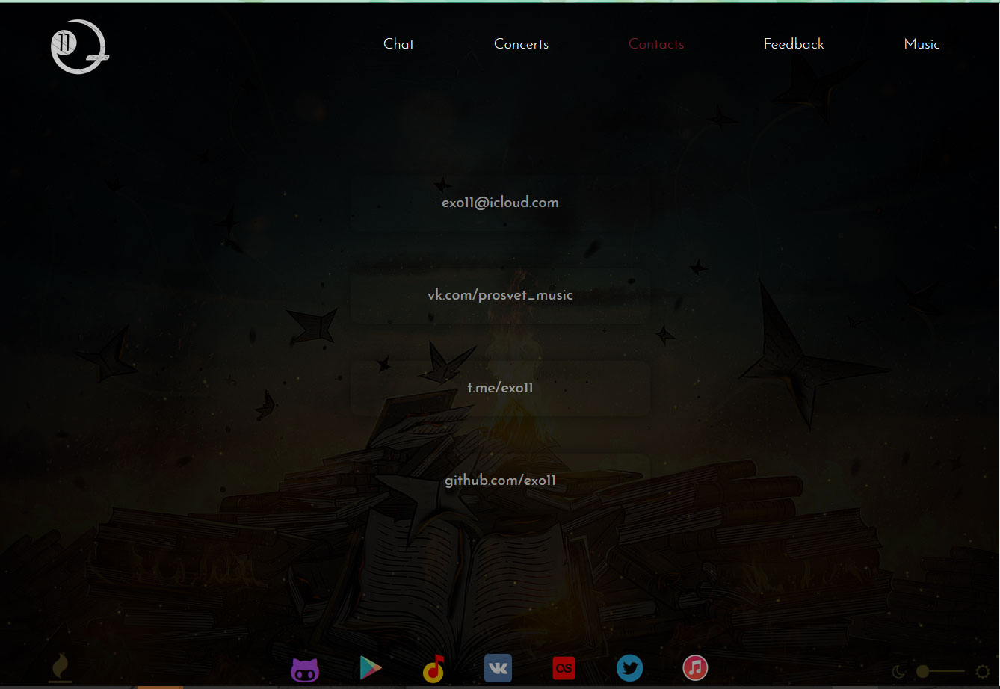

# Exo11.com
Сайт для музыкального проекта.

# [exo11.com](https://exo11.github.io/exo11.com/)

# Схема интерфейса

# Music (1)
Элемент __music__ скрывает/показывает плеер.

Функционал плеера play,pause,смена треков,отображение названия треков и времени проигрывания.
# Feedback (2)
Элемент __Feedback__ генерирует узел формы обратной связи.

# Contacts (3)
Элемент __contacts__ генерирует узел с контактами.

# Concerts (4)
Элемент __concerts__ получает с сервера массив с обьектами концертов , на основании полученной информации
создает карточки концертов с ссылками на сайты клубов для покупки билетов.

# Chat (5)
Элемент __chat__ генерирует чат.

# (6)
Элементы с классом __album_wrapper__ меняют альбомы.
Отображают плеер с выбранным альбомом.
# (7)
Элемент c id __spark_btn__ отключает/запускает анимацию.
# (8)
Иконки содержат ссылки на соответствующие соц сети и магазины
# (9)
Элемент с id __brightness_range__ позволяет регулировать opacity бэкграунда.
